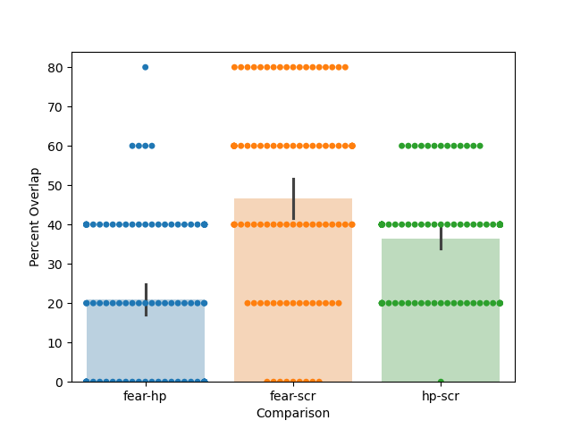
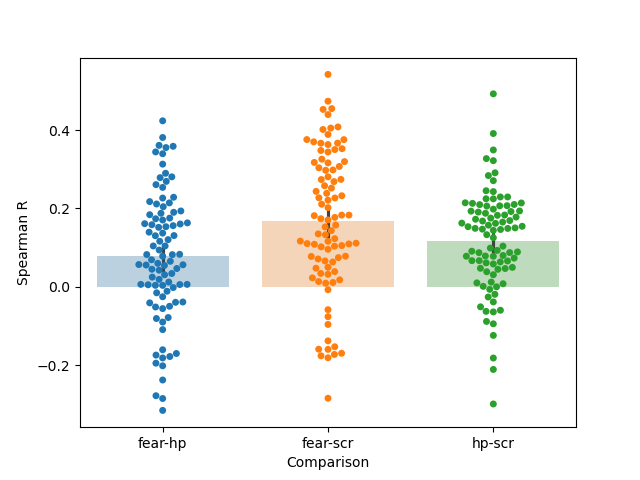

# Affective Recommendations

## In brief

### Overview

This repository contains code for training and evaluating collaborative filtering models on a dataset that includes physiological measurements and explicit fear ratings. The goal is to predict fear ratings based on participant and video identifiers, as well as to explore the relationship between physiological parameters (heart rate and skin conductance responses) and video recommendations.

### Dataset

The dataset consists of approximately 100 participants watching around 30 short videos. Physiological measurements and fear ratings were collected after each video. The dataset provides a unique opportunity to investigate personalized affective responses and compare the effectiveness of physiological measurements versus explicit ratings in generating video recommendations. Data is in `full_logfile_scr_0.py`

### Code Structure

- `fastai_cf.py`: This script trains collaborative filtering models for different target variables (explicit fear ratings, heart rates, and skin conductance responses) using 1-5 factors. Models are validated on 20% of the dataset, and training statistics and model weights are saved in the `results` and `models` directories, respectively.

- `create_loss_table.py`: A small script to aggregate the results from each training run.

- `fastai_cf_simulations.py`: This script simulates data an fits a collaborative filtering model for debugging purposes.

- `get_recs.py`: Creates rank recommendation matrices of participants by videos and saves them in the `results` directory. These matrices are used to generate bar plots in `create_bar_plots.py`.

- `helpers.py`: Includes all helper functions referenced in the scripts.

### Usage

To train the collaborative filtering models, run `fastai_cf.py` with the desired target variable. The resulting training statistics and model weights will be saved in the respective directories.

To generate recommendation matrices and bar plots, run `get_recs.py` and `create_bar_plots.py`, respectively.

### Results

The results of the trained models are presented in the `results` directory. The format of the result files is `{target_variable}_{n_epochs_trained}_{n_factors}_stats.csv`. Trained model weights are available in the same format in the `models` directory. The figures directory contains bar plots (with individual data points shown) comparing the similarity of recommendations made for each individual across the 3 different target variables.

### Conclusion

This project demonstrates the power of recommendation systems in modeling individual-level variance in affective responses. It also challenges the common assumption that physiological responses are equivalent to affective responses for all individuals. The findings highlight the importance of personalized recommendation systems in precision psychiatry and just-in-time interventions. Below I provide far more detail about the motivation, results, and conclusions of the project.

## In depth

### Motivation

As a psychologist I've been interested in recommendation systems for a while now for several reasons. The first being that at a societal level they're ubiquitous and are often the actual models behind what people refer to colloquially as the "algorithm" that controls their feed, music recommendations, and shopping suggested items. The next reason is that I think as a tool for the psychological science they have tremendous potential. In my view this potential comes from how recommendations systems (often) model how the combination of individual factors, and situational factors (or item factors in the language the recommendation system field uses) create behavior/psychological experiences. This repo is my first foray into testing out some recommendation systems.

To explore the use of some these techniques I chose this dataset physiology + affect dataset because I've become increasingly interested in how recommednation systems might be used in the context of precision psychiatry as well as just in time interventions( the dataset also happened to be a one I am very familiar with, but that's outside the narrative). While the current repo is more or less a toy example and pales in complexity to how these systems would need to be implemented in practice I think it has some nice features. First it is an affective context which a large body of research shows are highly personalized across individuals such that one situation (in this context a video) may evoke very different affective responses across people. This highly personalized nature seemed ripe for a recommendation system application. The second is that this dataset contains both physiology and affective data. I've increasingly seen wearable companies motion at the idea of taking some physiological reading inferring someone's affective state (which in my view "stress" falls under), then pushing that person a real time intervention. I was interested in this dataset if were to think of the videos as both situations, but also potential treaments, how might the recommended videos differ if we focused on the physiology recorded to each video versuses the explicit affective ratings. I think this comparison gets at the question of how well do physiology and affect correlate, or as is fashionable in the affective science community, how much coherence is there between these two different measures. Of course there are many more sophisticated ways to do both of these things which may work far better then this classic recommendation system technique but I think using these simple models (and laboratory dataset) into the extent to which we can use changes in physiology to drive affective changes. 

### Intro to Collaborative Filtering

To train the actual collobarative filtering models, I start very simply piggybacking on FastAI implemenation of a classic matrix factorization implementation. Under the hood this implementation creates a simple pytorch class which decomposes one's participants (or in recommendation system terms "users") x situations (recsys terms "items") matrix, into a set of set of latent factors for each participant a essentially a P x N  (latent factor) matrix we'll all P a S (situation) by N matrix well call S as well as a bias term for each participant (a P x 1 matrix, Pb) and situation (S X 1 matrix Sb). The predicted rating (or whatever target variable you've used for your matrix is predicted by) 

predicted_rating = dot(Pcurrent_participant,Scurrent_situatio) + Pbcurrent_participant + Sbcurrent_situatio

The free parameters, participant/video factors and biases are then trained via gradient descent which allows one's observation matrix to be sparse because you can estimate the parameters based on only your observed interactions rather then the full Participant by Video (or situation) matrix.

I think the Collaborative Filtering Recommendation System set up already is quite naturally suited to this psychological data of the type we use here. For instance one issue we often deal with in self report data is that people will use the scales differently. For example one person may rate their fear experiences using different range of the scale (i.e. from 0 - .5 out of 1 since they may have a salient example of a 1 like a near death experience that weekend) while another participant may use a range of .25 to .75. For these two participants, it may be that the relative pattern of their fear ratings across videos are quite similar but their absolute ratings are quite different. This way of decomposing the rating matrix can already account to this for some extent by seperating some of the absolute magnitude into the bias terms (intercepts) while the participant factors may capture relative similarities (particularly depending on what matric you use to measure that similarity). Of course there are many other techniques that can do this too however relatively few are used in the psychology take into account item effects (i.e. responses may be very item dependent not just person dependent, although item response theory springs to mind as a classic approach to this).

## Results

Below are the results for the different target variables and the different number of factors. Note all models well outperformed a "mean" model which predicts a participants response to a video based on the mean of the responses of the other participants in the training set. Also worth nothing is that for the two physiologically based target variables improvements over the factor model with additional factors are relatively modest in the range of 1% to 2%. This is likely in part because people often have different "baseline" rates of physiological activation so once the bias terms account for that within individual (and possibly video) the residual variance that is reliably structured in this data set is relatively small.

| Resp Fear Losses |        | Video HP Losses |        | Video SCR Losses |        |
|:-----------------|-------:|:----------------|-------:|:-----------------|-------:|
| n_factors        | valid_loss | n_factors     | valid_loss | n_factors       | valid_loss |
|------------------|----------|----------------|----------|------------------|----------|
| mean             | 0.0613301 | mean           | 0.0265361 | mean            | 0.00455745 |
| 1                | 0.0421532 | 1              | 0.00361519 | 1               | 0.00360117 |
| 2                | 0.0368893 | 2              | 0.00356759 | 2               | 0.00359711 |
| 3                | 0.0362336 | 3              | 0.00354983 | 3               | 0.00357163 |
| 4                | 0.0330726 | 4              | 0.00354452 | 4               | 0.00359156 |
| 5                | 0.0327866 | 5              | 0.003557   | 5               | 0.00358203 |

After training all models I compare their recommendations and representations to show that videos that evoke the greatest responses for each type of videos for each person can vary drastically across people, see below. These results suggest while for some people (in this context) using physiology as a proxy to recommend items to bring about a certain desired affective state might be reasonable, for many others it will be ineffective.

### Comparing similarity of top ranked videos across target variables

  
  

*On the left we compare the percent overlap for the top 5 ranked videos for each person. As we can see the percent overlap is highly variable across individuals but overall suggests the idea of using physiology alone as a proxy for explicit ratings does not reproduce the same set of recommendations. On the right we compare the spearman's correlation across the entire set of ranking, these results again suggest training the models on physiology vs explicit ratings lead to very different recommendations. Interestingly both sets of results also suggest the different parameters of physiology SCR vs Heart Rate give quite different information*

 These results suggest the power of recommendations systems as we can look model this variance at the individual level, but also that the common assumption made by many lay people, psychologists, and corporations that physiological responses = affective responses isn't true for many of the individuals in the dataset. Below I expand on pretty much every part of the project and my thoughts on it for those interested.

### Conclusions, More Thoughts, and Todos

Overall I think more less showed what most physiologists would predict. You can't use physiology as reliable proxy for emotion/affective experience across people. Now there are of course all sorts of caveats to this, this is a very limited dataset, we are only looking at 1 emotion in this analysis, and it's a lab based task. All of these are valid but I think this conclusion still stands based on 50 plus years of physiology work. With that being said there maybe situations in which certain physiological parameters are more or less useful in which you might be able to use this sort of collaborative filtering approach to query this question by looking at the combination of siutation + individual factors. 

Even more broadly though this sort project has made me think of a few more questions. One is what should we be optimizing for not just in our machine learning models but in our lives. This question of course depends on the context and your goal but I think answers are often given implicitly to us with out that much thought For instance wearables make it really easy to measure physiology, and what get's measured gets optimized for but is physiology the right choice? I don't think it's meaningless but I don't know if we should always be optmizing for physiology. Like wise the same thing is true with affect, of course you need to feel bad some of the time but if everytime you feel bad you get pushed a breathing exercise I'm not sure it's a good thing. I think the underlying thing of what I'm saying is that if we're not careful we'll end up with algorithms that treat us like machines where you want all levels of everything to be in the optimal range at all times. But we're biological (complex) systems where physiology, and affect changes dynamically for good reason. I won't pretend I know all the reasons but these dynamic changes have developed over 1000 of years of evolution so there's likely good reasons.  So while of course there's potential for AI + Recommendation systems in precision psychiatry, the wearable space, and wellness space developing them will be difficult and need to be an iterative process rather than over rigid emphasis on minimizing loss for a few easy to measure metrics.

